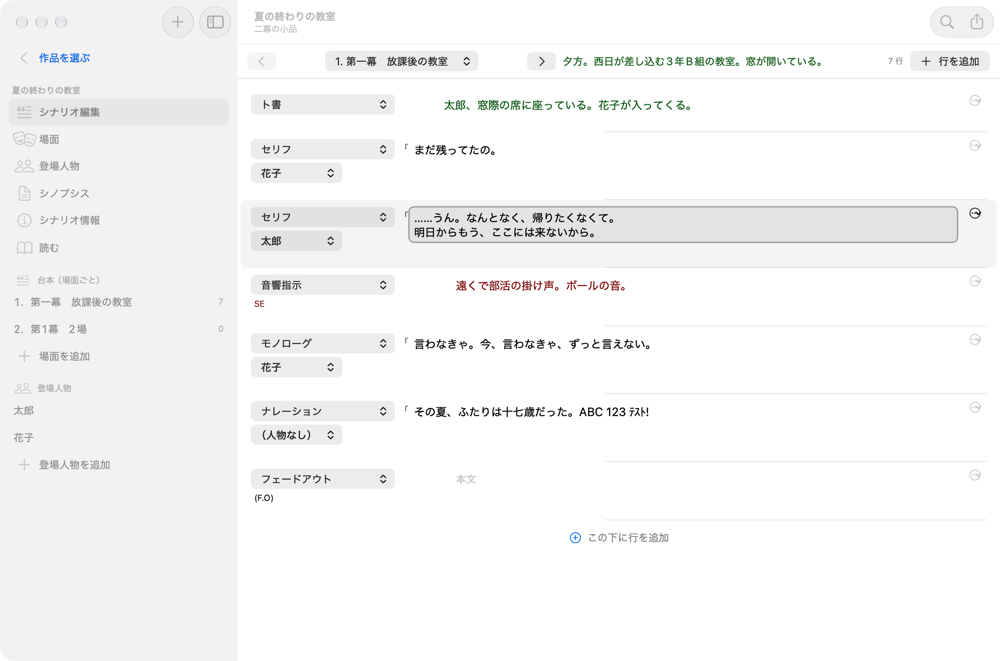
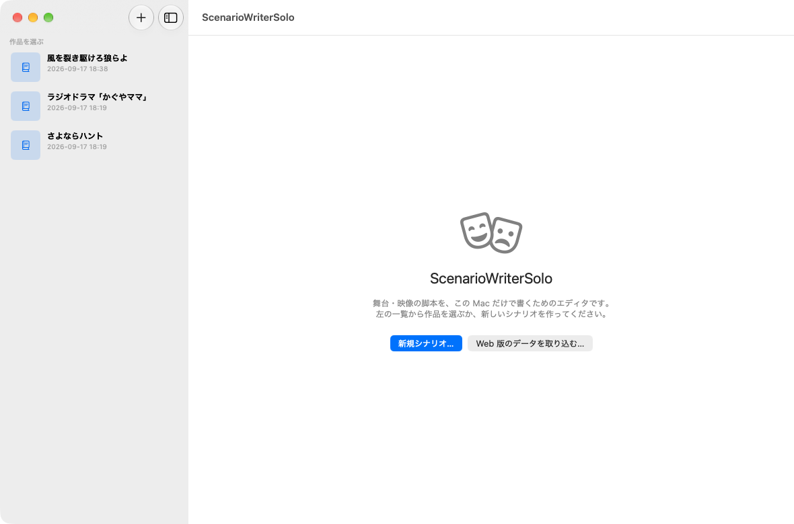
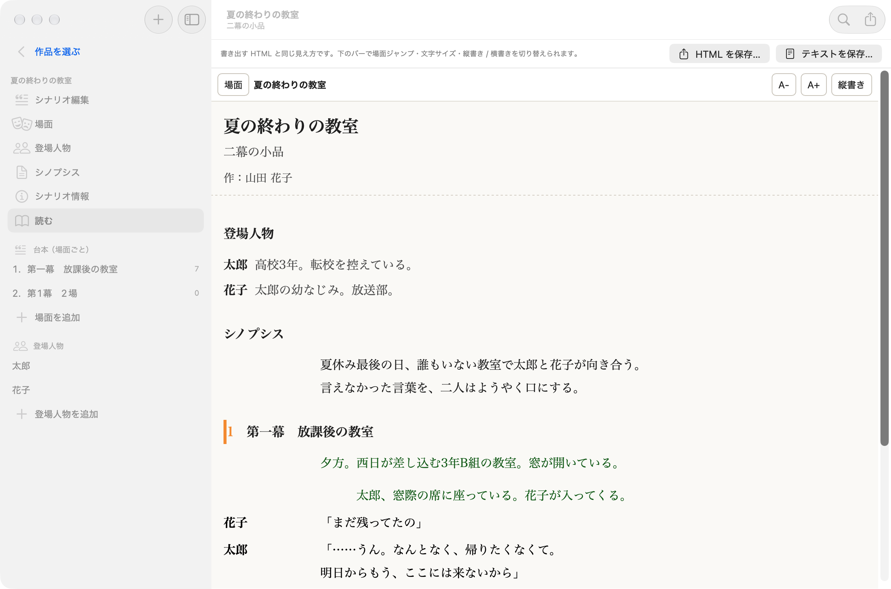
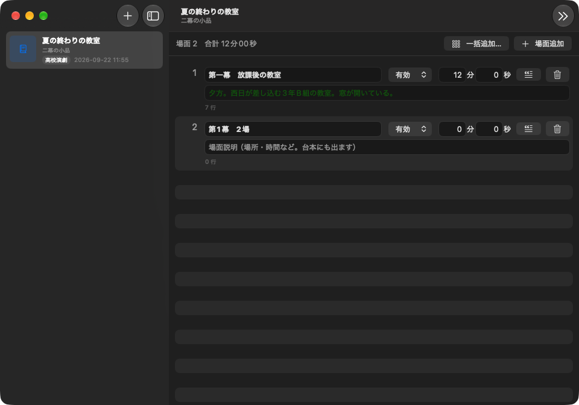

# ScenarioWriterSolo

舞台・映像の脚本を **この Mac だけで** 書くための、ひとり用の脚本エディタです。
Web 版 [ScenarioWriterCafe](https://github.com/ICTCacao/ScenarioWriterCafe)（PHP + SQLite）と同じ考え方で、
PHP も Web サーバもログインも要りません。アプリを開けばすぐ書けます。作品ファイルは Windows 版（開発予定）と共通の JSON です。

| | Web 版 ScenarioWriterCafe | **ScenarioWriterSolo** |
|---|---|---|
| 動く場所 | レンタルサーバ / ローカルの PHP | macOS 15 以降の Mac（Apple Silicon / Intel） |
| 必要なもの | PHP 7.4+、ブラウザ | なし |
| データ | `sw_config/swdata.sqlite`（SQLite） | 1 作品 1 ファイルの `タイトル.scwd`（JSON。[形式の説明](docs/scwd-format.md)。Web 版からの取り込みと Web 版用の書き出しあり） |
| 仲間に読んでもらう | 劇団員プレビュー（鍵付き URL） | HTML 1 ファイルを書き出して送る |
| 台本ファイル | テキスト / Word（3 種） / XML | 同じ |



## マニュアル

[docs/MANUAL.md](docs/MANUAL.md)（PDF: `docs/ScenarioWriterSolo-マニュアル.pdf`。DMG と `dist/` にも入っています）。Windows 版は [ScenarioWriterWin/docs/MANUAL.md](ScenarioWriterWin/docs/MANUAL.md)。

## 見本の作品

`samples/sample.scwd`（架空の短い作品「夕暮れの谷」。セリフ・ト書・ナレーション・モノローグ・歌詞・テロップ・音響/照明指示・F.I/F.O を一通り使っています）。DMG と Windows 版の zip にも `sample.scwd` として入っているので、最初に開いて画面や Word 出力を試せます。

## Windows 版

同じ作品ファイルを読み書きする Windows 版（Tauri）が [ScenarioWriterWin/](ScenarioWriterWin/) にあります。配布物は `dist/ScenarioWriterWin-β8-windows.zip`（インストーラ・単体 exe・[マニュアル](ScenarioWriterWin/docs/MANUAL.md)）。版の呼び方は Mac 版と揃えて β8（インストーラの内部番号だけ 0.8.0）。

## 画面の流れ

0. ふつうの書類アプリと同じで、作品は 1 つずつ `タイトル.scwd` というファイルです。「ファイル › 開く…」（⌘O）で開き、「新規シナリオ…」（⌘N）では保存先を聞かれます。編集はアプリ内の作業用コピーに自動で書かれ、**保存（⌘S）で本ファイルへ書き戻します**。未保存の変更があるとウインドウの閉じるボタンに点が付き、閉じる・終了・別の作品を開くときに「保存 / 保存しない / キャンセル」を聞きます。保存せずに落ちても、次回起動時に回復を提案します。「別名で保存…」「複製を保存…」「最後に保存した状態に戻す」「閉じる」もあります。
1. 起動すると**前回開いていた作品**がそのまま開きます。サイドバーの「作品を選ぶ」には最近使った作品が並びます。
2. サイドバーには開いている作品の **画面（シナリオ編集・場面・登場人物・シノプシス・シナリオ情報・読む）**、**台本（場面ごと）**、**登場人物** が並びます。場面をクリックするとその場面の台本、登場人物をクリックすると登場人物設定に移ります。
3. 別の作品に切り替えるときは、サイドバー上の **「作品を選ぶ」** で最近使った作品の一覧に戻り、作品をクリックするか「ほかのファイルを開く…」を使います。「開いている作品に戻る」で戻れます。

## できること

- **場面・登場人物・台詞** を分けて書き、ドラッグや ⌘⌥↑↓ で並び替え、⌘⏎ で行を追加。Tab / ⇧Tab（⌘↓ / ⌘↑）で次・前の行へ
- 台詞はクリックしてその場で直す **インライン編集（自動保存）**。種別（セリフ / ト書 / 歌詞 / ナレーション…）と登場人物は行ごとのメニューで選ぶ
- **縦書きで編集**（ツールバーの「縦書き / 横書き」ボタンで一発切り替え。設定 › 書式「編集の書き方向」、シナリオ › 縦書きで編集 ⌥⌘T でも）… 行が右から左へ並び、各行の本文は上から下。Tab / ⇧Tab のほか ⌘← / ⌘→ で前後の行へ。画面の左右の ‹ › でページ送り（約 1 画面ずつ。マウスを端の列に持っていくと出る）。ツールバー中央のミニマップで場面全体のどこを見ているかがわかり、クリックでそこへ飛べる。場面・登場人物・シノプシスの画面も縦書きになる（場面説明・人物設定の既定の幅は上の入力欄と同じで、長くなると列が増える）。台本の列は見えている分だけ作るので、数百行の場面でもウインドウの大きさを変えたときに固まらない。シノプシスの縦書き欄は枠の高さで折り返す
- **本文の折り返し** … 編集画面の本文欄（台詞・場面説明・人物設定・シノプシス）も「読む」と同じく 設定 › 書式 の「本文の文字数」（−字下げ）で折り返す。文字の大きさはスタイルのサイズに従う
- **固定スタイル** … 設定 › スタイル の一覧の末尾に「シノプシス」「場面説明」「登場人物」（🔒）がある。フォントサイズ・色・字下げ・前後の余白を変えられるが、名前の変更と削除はできない。サイズと色は編集画面と「読む」画面に、字下げと余白は「読む」画面に効く（テキスト・Word の出力は従来どおり）
- 作品全体の **検索と置換**（⌘F）
- **元に戻す / やり直す**（⌘Z / ⇧⌘Z）… 行の追加・削除・並び替え・別の場面への移動・種別と登場人物の変更・本文の確定、置換、場面と登場人物の追加・削除・並び替え・変更、シノプシスとシナリオ情報の変更。作品を閉じる／切り替えるまで有効。本文欄の中の文字入力は欄ごとの履歴（欄にいる間だけ）
- **シノプシス**、**シナリオ情報**（タイトル・作者・分類・メモ・作品画像）、**シナリオ複写**
- **読む** … Web 版の劇団員プレビューと同じ画面で通し読み。縦書き / 横書き（ツールバーのボタンでも）、文字サイズ、場面ジャンプ。縦書きは左右の ‹ › でページ送り。ミニマップは作品全体。登場人物名欄と本文の幅は「設定 › 書式」の文字数に揃い、半角の英数・カナは全角で表示
- **書き出し**（⌘E）
  - テキスト（UTF-8 / Shift_JIS、LF / CRLF / CR。登場人物名欄と本文の文字数、禁則処理付き折り返し）
  - Word … A4縦 縦書き / A4縦 横書き / A4横 縦書き（株式会社 deerstudio 配布の脚本テンプレート。表紙に作者名・日付（和暦）・住所などが入る）
  - XML（Word 2003 XML、横書き）
  - HTML（1 ファイル完結。スマホでも縦書き / 横書きで読める。劇団員に渡す用）
- **スタイル設定**（設定 › スタイル）… 種別ごとの色・字下げ・省略文字・「登場人物名を出す / 台詞を「」で囲む」・前後の余白（行数）。既定 13 種（セリフ / ト書 / 歌詞 / ナレーション / モノローグ / テロップ / 演技指示 / 音響指示 / 照明指示 / フェードイン・アウト / カットイン・アウト、サイズ 14、余白付き）、自分で追加も
- **文字の大きさ** … ツールバーのスライダーで（編集画面は基準サイズ、「読む」は読む画面の文字）
- **書式設定**（設定 › 書式）… テキスト出力の文字数、台詞を「」で囲むかどうか、編集画面のフォント・基準サイズ・行間・文字間隔。スタイルのフォントサイズは「サイズを一括設定…」でまとめて変更可
- **Web 版のデータを取り込む** … Web 版の `sw_config/swdata.sqlite` を選ぶだけ。逆に、Solo のバックアップを Web 版に置いてもそのまま開けます

| 作品を選ぶ | 読む（縦書き / 横書き） | 場面設定 |
|---|---|---|
|  |  |  |

## インストール

1. [Releases](../../releases) の `ScenarioWriterSolo-<版>.dmg` を開き、アプリを Applications へドラッグ
2. 初回は Applications 内のアプリを右クリック →「開く」（Apple の公証を受けていないため）
3. 起動したら「新規シナリオ…」（⌘N）で保存先を決めて書き始めるか、「開く…」（⌘O）で `.scwd` を開きます。Web 版から移るなら「Web 版のデータを取り込む…」

作品ファイル `タイトル.scwd` は Web 版の `swdata.sqlite` と同じ形式の SQLite（1 作品だけ入り）です。
2 時間の舞台でも数 MB なので、ファイルをコピーすればバックアップになります。iCloud Drive や Dropbox のフォルダに置けばそのまま同期されます。
`.scwd` をダブルクリックすると ScenarioWriterSolo で開きます。
スタイルと書式の共通設定だけが `~/Library/Containers/com.ictcacao.ScenarioWriterSolo/Data/Library/Application Support/ScenarioWriterSolo/settings.sqlite` に入ります。

## Web 版との行き来

- **Web → Solo** … Web 版の `sw_config/` フォルダをダウンロードし、「ファイル › Web 版・バックアップから取り込む…」で **フォルダごと** 選び、次に分割先のフォルダを選ぶ。中の作品が 1 作品 1 ファイルに分かれてそのフォルダに入ります（`swdata.sqlite` だけでも取り込めますが、`swdata.sqlite-wal` に残っている直近の更新が抜けることがあるので、フォルダごとがおすすめ）。
- **Solo → Web** … 「ファイル › この作品を Web 版用に書き出す…」で `swdata.sqlite` を書き出し、Web 版の `sw_config/swdata.sqlite` として置く（Web 版の初期設定を済ませてから上書き）。作品ファイル `.scwd` をそのまま `swdata.sqlite` に改名しても同じです。Web 版のログインユーザーは `SW_USER` の先頭ユーザーになるので、取り込み直後はパスワードリセットで入ってください。

作品画像（サムネイル）は作品ファイルの中の `SW_SOLO_THUMB` 表に入ります（Web 版はこの表を使いません）。

β5 より前の `.scwd`（SQLite）も開けます。保存すると JSON になります。たくさんあるときは「ファイル › 旧形式（SQLite）の作品ファイルをまとめて変換…」でフォルダごと変換できます（元のファイルは「旧形式」フォルダに残ります）。Windows 版は JSON だけを読むので、Windows に持っていく前に変換してください。初期の版（1.0.0）で `swdata.sqlite` 1 つに全作品を入れていた場合は、起動画面の「作品ファイルに分けて保存…」でフォルダを選ぶと作品ごとのファイルに分かれます（元のファイルは `swdata.migrated.sqlite` として残ります）。

## 構成

```
ScenarioWriterCafe/                 # このリポジトリ
├── project.yml                     # XcodeGen の定義（ここから .xcodeproj を生成）
├── ScenarioWriterSolo.xcodeproj    # 生成物（xcodegen generate で再生成できる）
├── make-dmg.sh                     # 配布用 dmg を作る
├── icon/make-icon.swift            # アプリアイコンを描くスクリプト
├── dist/                           # ビルド済み: *.app / *.dmg
├── ScenarioWriterSolo/             # Mac アプリ（SwiftUI）
│   ├── ScenarioWriterSoloApp.swift # エントリ・メニュー
│   ├── AppModel.swift              # 画面の状態と ScenarioStore への読み書き
│   └── Views/                      # 一覧・台本・場面・登場人物・シノプシス・情報・読む・書き出し・設定
└── Packages/ScenarioWriterCore/    # UI に依存しないコア
    ├── Models.swift                # Scenario / ScriptScene / CastMember / ScriptLine / LineStyle …
    ├── SQLiteDatabase.swift        # SQLite3 C API の薄いラッパ（依存なし）
    ├── ScenarioStore.swift         # Web 版と同じスキーマの作成・CRUD・複写・検索・取り込み
    ├── TextFormat.swift            # 全角化・禁則処理付き折り返し・和暦（令和対応）
    ├── ScriptFormatter.swift       # 種別（USER STYLE）の解決。画面と全出力で共通
    ├── Exporters/                  # Text / Docx / Pdf / Xml / Html、ZIP 書き出し
    └── Resources/                  # Word テンプレート（deerstudio）と XML 断片（Web 版から抽出）
```

Web 版の `SW_SCENARIO_LINES.SCENARIO_LINES` などは改行を `<br>` で持つ流儀なので、アプリ内では `\n` に直して扱い、保存時に戻しています。

## ビルド

必要: macOS 15 以降、Xcode 26 以降、XcodeGen（`brew install xcodegen`）。

```bash
cd ~/CacaoApps/ScenarioWriterCafe
xcodegen generate                       # project.yml を変えたときだけ
xcodebuild -project ScenarioWriterSolo.xcodeproj -scheme ScenarioWriterSolo -configuration Release \
  -derivedDataPath build/DerivedData build
rm -rf dist/ScenarioWriterSolo.app && cp -R build/DerivedData/Build/Products/Release/ScenarioWriterSolo.app dist/
./make-dmg.sh                           # dist/ScenarioWriterSolo-<版>.dmg
```

コアのテスト: `cd Packages/ScenarioWriterCore && swift test`

## Web 版との細かな違い

- ログイン・パスワード・劇団員プレビューの URL 発行はありません（ひとり用のローカルアプリなので不要）。代わりに HTML 書き出しで渡します
- 台詞の「」は、スタイルと「台詞を「」で囲む」設定に従って **画面・読む・テキスト・Word・XML・HTML のすべて** に付きます（末尾の「。」は落とします）
- Word の表紙の日付は和暦で、令和に対応しています
- 場面を削除すると、その場面の台詞も消えます。登場人物を削除すると、その台詞は名前なしになります

## ライセンス

MIT License。詳細は [LICENSE](LICENSE) を参照してください。
Word テンプレート（`Packages/ScenarioWriterCore/Sources/ScenarioWriterCore/Resources/docx/`）は株式会社 deerstudio 配布の脚本テンプレートを Web 版から引き継いでいます。
