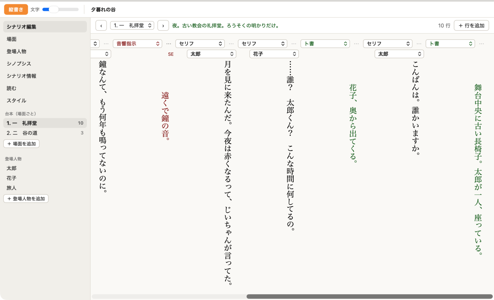
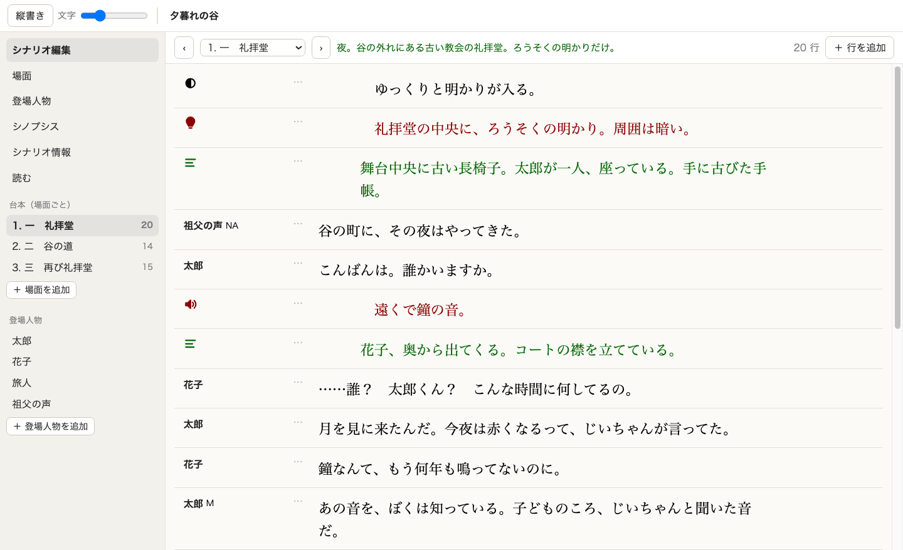
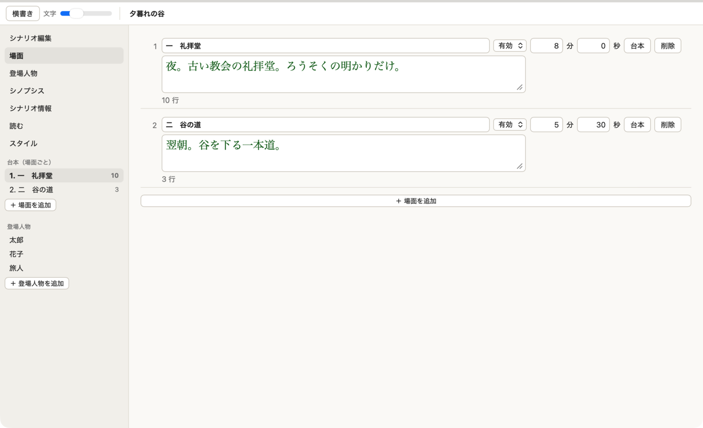
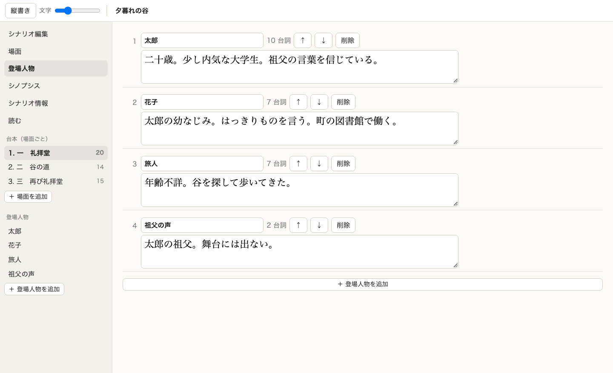
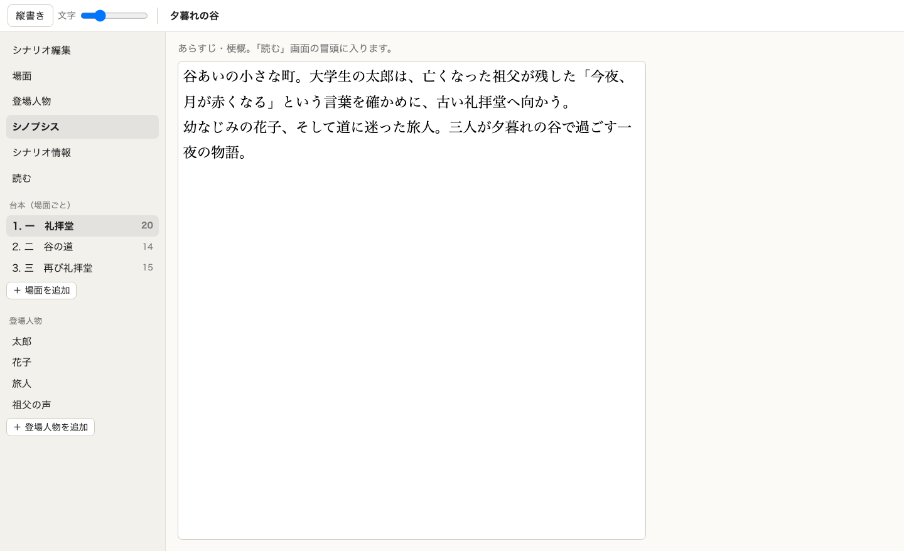
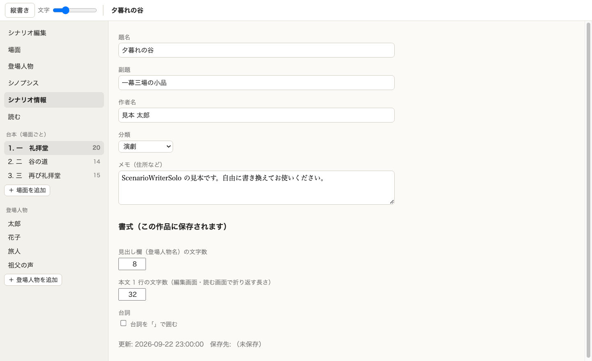
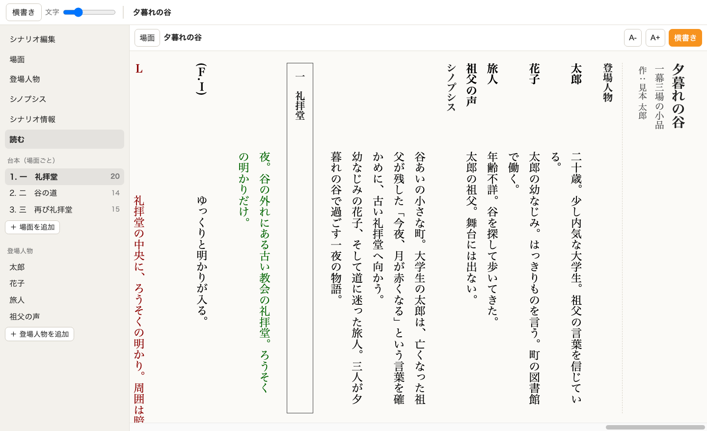
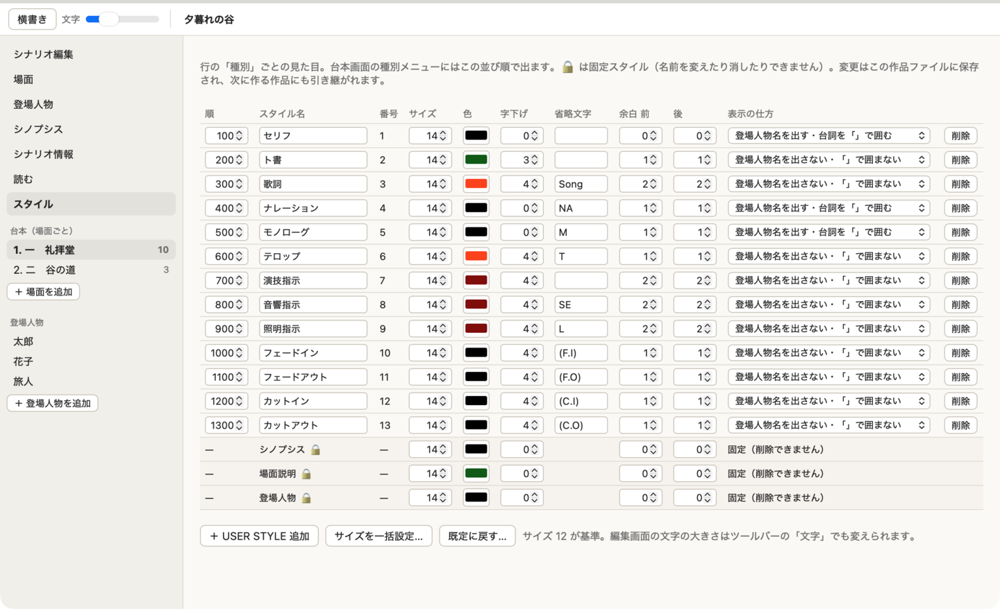
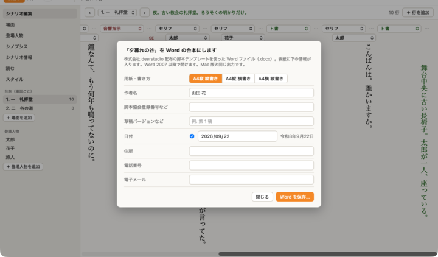

# ScenarioWriterSolo（Windows 版）マニュアル

β8　2026 年 9 月

ScenarioWriterSolo は、舞台・映像の脚本を書くためのひとり用エディタです。この Windows 版は、Mac 版 ScenarioWriterSolo と同じ作品ファイル（`タイトル.scwd`）を読み書きします。縦書きでの編集が目玉です。

## 1. インストール

1. `ScenarioWriterWin-β8-setup.exe` をダブルクリックします。
2. 「Windows によって PC が保護されました」（SmartScreen）が出たら、「詳細情報」→「実行」を押します（署名していないため一度だけ出ます）。
3. 画面の案内どおりに進めると、デスクトップとスタートメニューに ScenarioWriterWin ができ、`.scwd` ファイルがこのアプリに関連付けられます。

インストールせずに使うときは `ScenarioWriterWin-β8-portable.exe` をそのまま起動します（Windows 10/11 の WebView2 が入っていれば動きます。この場合 `.scwd` の関連付けはされません）。

アンインストールは「設定 › アプリ」から。作品ファイルは消えません。

配布ファイルに入っている `sample.scwd` は見本の作品（架空の短い戯曲「夕暮れの谷」）です。まずこれを開いて、画面や Word の書き出しを試してみてください。

## 2. 作品ファイル

- 作品は 1 つずつ `タイトル.scwd` というファイルです。中身は文字（JSON）なので、Mac 版と相互に持ち運べます。
- **Mac 版で β5 より前に作った `.scwd` は開けません**。Mac 版で開いて保存するか、「ファイル › 旧形式（SQLite）の作品ファイルをまとめて変換…」で新しい形式にしてから持ってきてください。
- ふつうの書類アプリと同じで、編集した内容は **Ctrl+S で保存** します。未保存の変更があると、題名の横に「未保存の変更あり」と出ます。閉じるときに保存するか聞きます。
- 「ファイル › 最近使った作品」の代わりに、作品を開いていないときの画面に最近開いたファイルが並びます。

## 3. 画面の構成

- **メニューバー**: ファイル / 編集 / 表示 / 設定 / ヘルプ。よく使う操作はショートカットもあります（後述）。
- **ツールバー**: 縦書き / 横書きの切り替え、編集画面の文字の大きさ、いま開いている作品の題名。
- **左の一覧**: 画面（シナリオ編集・場面・登場人物・シノプシス・シナリオ情報・読む）、台本（場面ごと、行数つき）、登場人物。スタイルはメニューの「設定 › スタイル…」から開きます。場面をクリックするとその場面の台本に、登場人物をクリックすると登場人物の画面に移ります。

## 4. 台本を書く（シナリオ編集）

1 行が「種別」「登場人物」「本文」の組です。上のバーで場面を選び、「＋ 行を追加」で末尾に行を足します。

- **見出し**: ふだんは人物名だけが出ます（ト書・歌詞など人物を出さない種別は、その種別の色のアイコン）。名前やアイコンをクリックすると種別と登場人物の選択ボックスになり、人物を選ぶか本文をクリックすると閉じます。
- **種別**（セリフ・ト書・歌詞・ナレーション…）を選ぶと、色や字下げ、名前を出すかどうか、「」で囲むかがスタイルどおりに変わります。
- **登場人物**は、名前を出す種別のときだけ選べます。
- **本文**はそのまま打ちます。日本語入力も縦書きのまま使えます。本文は「シナリオ情報」の「本文 1 行の文字数」（既定 32 文字、字下げのぶんは引く）で折り返します。「読む」画面やテキスト出力と同じ折り返しです。
- 人物名の隣の「⋯」（縦書きでは選択ボックスを開いたとき）か、行の右クリックから、前後に行を足す・前後へ動かす・削除ができます。

### キー操作（本文の中で）

| キー | 動き |
|---|---|
| Tab / Shift+Tab | 次の行 / 前の行へ（縦書きでは左 / 右の列へ） |
| Ctrl+Enter | この行の後に行を追加（Shift を足すと前に） |
| Ctrl+↓ / Ctrl+↑（横書き）、Ctrl+← / Ctrl+→（縦書き） | 次の行 / 前の行へ |
| Ctrl+Alt+矢印 | 行を前後に動かす |
| Ctrl+Z | 打った文字を元に戻す（その欄の中だけ） |
| Esc | 欄から抜ける |

### 縦書きと横書き

ツールバーのボタンか Ctrl+Alt+T で切り替えます。ボタンには押すと切り替わる先が出ます（横書きのときは「縦書き」、縦書きのときは「横書き」）。縦書きでは行が右から左へ並び、各行の本文は上から下へ書きます。各列の上には人物名が縦書きで出て、本文の欄は画面の高さに収まります。場面・登場人物・シノプシスの画面も縦書きになります。この設定はアプリが覚えていて、作品ファイルには入りません。

## 5. 場面

場面名（柱）、有効 / 無効、上演時間の目安、場面説明を書きます。場面説明は台本の柱の下に出ます。「台本」ボタンでその場面の台本へ。左の一覧の「＋ 場面を追加」で場面を足します。

## 6. 登場人物

登場人物名と人物設定（年齢・性格など）を書きます。人物設定は「読む」画面の人物表に出ます。↑↓（縦書きでは → ←）で並び順を変え、「削除」で消します（その人物の台詞は名前なしになりますが、台詞そのものは残ります）。

## 7. シノプシス

あらすじ・梗概です。「読む」画面の冒頭に入ります。縦書きのときは、本文と同じ文字数で折り返した縦書きの欄になります。

## 8. シナリオ情報と書式

題名・副題・作者名・分類・メモと、この作品の書式（見出し欄の文字数、本文 1 行の文字数、台詞を「」で囲むか）です。書式は作品ファイルに保存されます。

## 9. 読む

台本を通し読みする画面です。Mac 版や Web 版の「劇団員プレビュー」と同じ見た目で、登場人物表・シノプシス・場面ごとの柱と台詞が並びます。上のバーで縦書き / 横書き、文字の大きさを変え、「場面」から場面へ飛べます。縦書きのときは、マウスを画面の左端・右端の列に持っていくとページ送りのボタン（‹ 次のページ / › 前のページ）が出て、見えている幅の 4/5 ぶん動きます（前のページの最後の列が見えたまま残るので、続きを追えます）。先頭・最後まで来たほうのボタンは消えます。

## 10. スタイル

行の「種別」ごとの見た目です。「設定 › スタイル…」（Ctrl+7）で開き、表の中でそのまま直せます。

| 項目 | 意味 |
|---|---|
| 順 | 種別メニューに並ぶ順 |
| スタイル名 | 種別の名前 |
| 番号 | 台詞の種別番号（変えられません） |
| サイズ | 文字の大きさ。12 が基準で、編集画面・読む画面ともこの比率で大きくなります |
| 色 | 文字の色 |
| 字下げ | 本文の頭を下げる文字数 |
| 省略文字 | 名前を出さない種別で本文の前に付く印（NA / M / SE など） |
| 余白 前 / 後 | 「読む」画面で行の前後に空ける行数（0〜4） |
| 表示の仕方 | 登場人物名を出すか、台詞を「」で囲むか |

「＋ USER STYLE 追加」で種別を足し、「削除」で消します（その種別を使っていた行は「種別 N」として残ります）。「既定に戻す」で最初の 13 種に戻ります。下の 3 行（シノプシス・場面説明・登場人物）は固定スタイルで、大きさ・色・字下げ・余白だけ変えられます。

スタイルは作品ファイルに保存されます。次に新しい作品を作るときは、最後に保存した作品のスタイルが引き継がれます。

## 11. Word の台本を書き出す

「ファイル › Word の台本を書き出す…」（Ctrl+E）で、株式会社 deerstudio 配布の脚本テンプレートを使った Word ファイル（.docx）を作ります。Mac 版と同じ出力です。

- **用紙・書き方**: A4 縦の縦書き / A4 縦の横書き / A4 横の縦書き。
- **表紙**: 作者名（作品の作者名が入っています）、脚本協会登録番号など、草稿バージョン（例: 第 1 稿）、日付（和暦で入ります。不要ならチェックを外す）、住所・電話番号・電子メール。入れた内容は次回も覚えています。
- 「Word を保存…」で保存先を選びます。登場人物表・シノプシス・場面ごとの台詞が、テンプレートの書式（人物名欄・字下げ・前後の余白）で入ります。Word 2007 以降で開けます。

テキスト（.txt）や HTML の書き出しはこの版にはありません。

## 12. メニューとショートカット

| メニュー | 項目 | ショートカット |
|---|---|---|
| ファイル | 新規… / 開く… / 保存 / 別名で保存… / Word の台本を書き出す… / 作品を閉じる / 終了 | Ctrl+N / Ctrl+O / Ctrl+S / Ctrl+Shift+S / Ctrl+E / Ctrl+W |
| 編集 | 元に戻す・やり直す・切り取り・コピー・貼り付け・すべて選択、行の追加・削除、場面を追加、登場人物を追加 | （本文の中では Ctrl+Z / Ctrl+X / Ctrl+C / Ctrl+V など通常どおり） |
| 表示 | シナリオ編集〜スタイルの各画面、前後の場面、縦書きで編集、文字を大きく / 小さく | Ctrl+1〜7、Ctrl+[ / ]、Ctrl+Alt+T、Ctrl+= / Ctrl+- |
| 設定 | 書式（本文の文字数・「」）…、スタイル… | |
| ヘルプ | バージョン情報 | |

## 13. Mac 版との違い（この版でまだ無いもの）

- テキスト / HTML ファイルの書き出し（Word はあります。テキストと HTML は Mac 版で開いて書き出してください）
- Web 版 ScenarioWriterCafe のデータの取り込み
- 行の追加・移動・削除の「元に戻す」（本文の文字入力は Ctrl+Z が効きます）
- 共通の設定ファイル（スタイルと書式は作品ファイルごとです）

## 14. 困ったとき

- **作品ファイルを開けません（旧形式）**: Mac 版 β5 以降で開いて保存すると開けるようになります。
- **文字が小さい / 大きい**: ツールバーの「文字」で編集画面の大きさを変えられます。「読む」画面は A- / A+ で。
- **アイコンが古いまま**: インストールし直したあとも変わらないときは、いったんサインアウトするか、コマンドプロンプトで `ie4uinit.exe -show` を実行してください。
- **問題の報告**: ICTCacao（dbu@ictcacao.com）まで。作品ファイルと、出ていたメッセージを添えてもらえると助かります。
