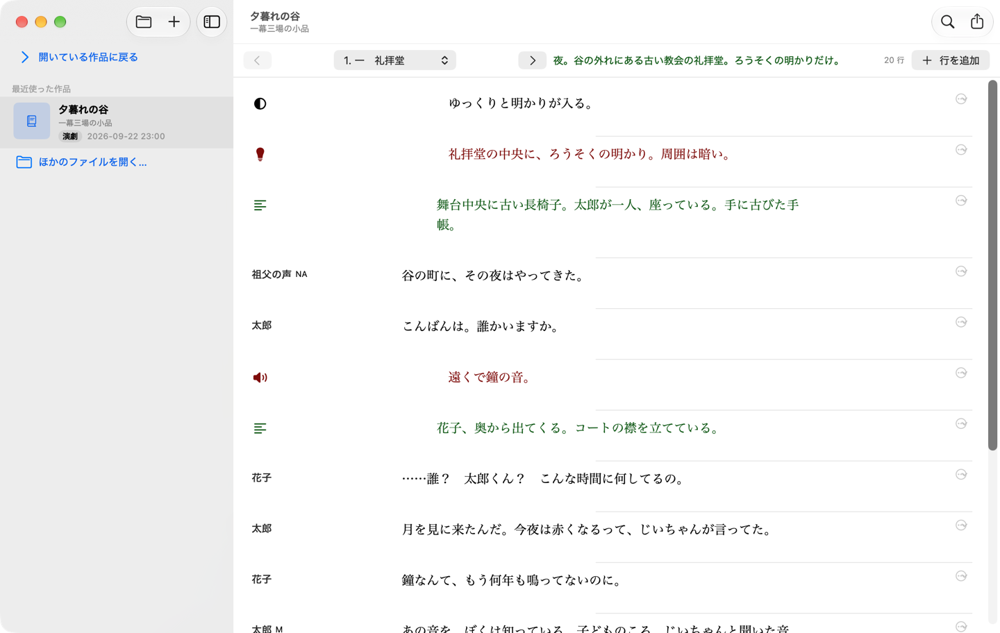
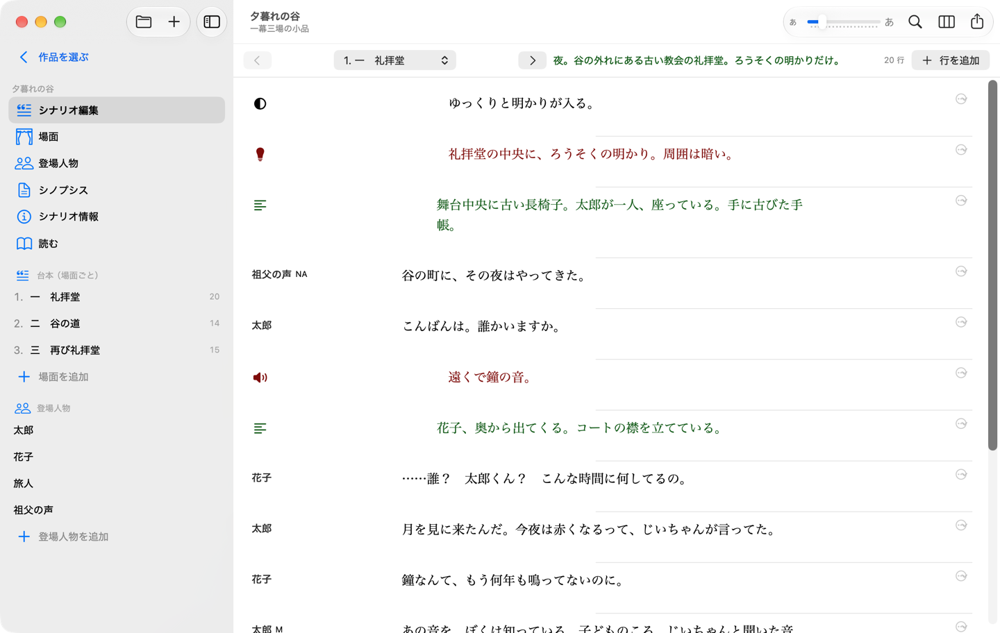
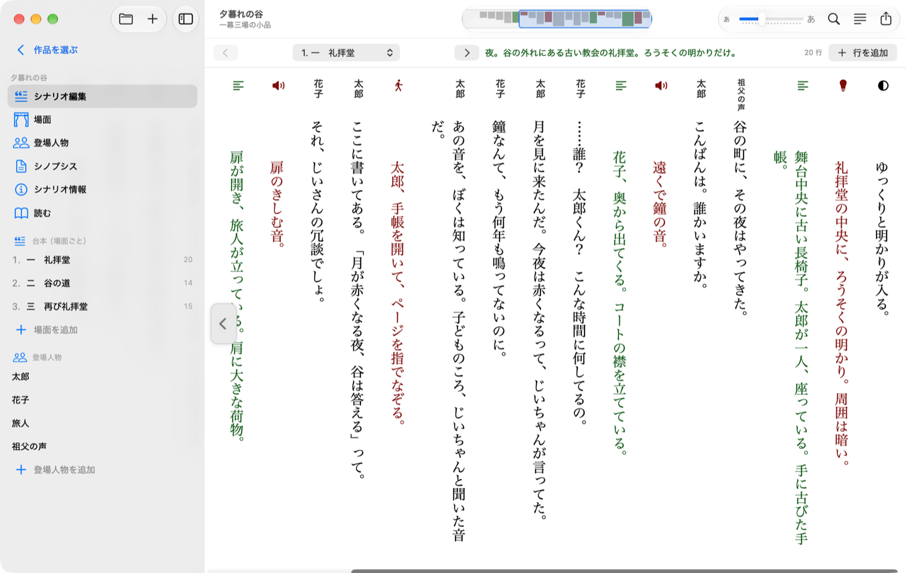
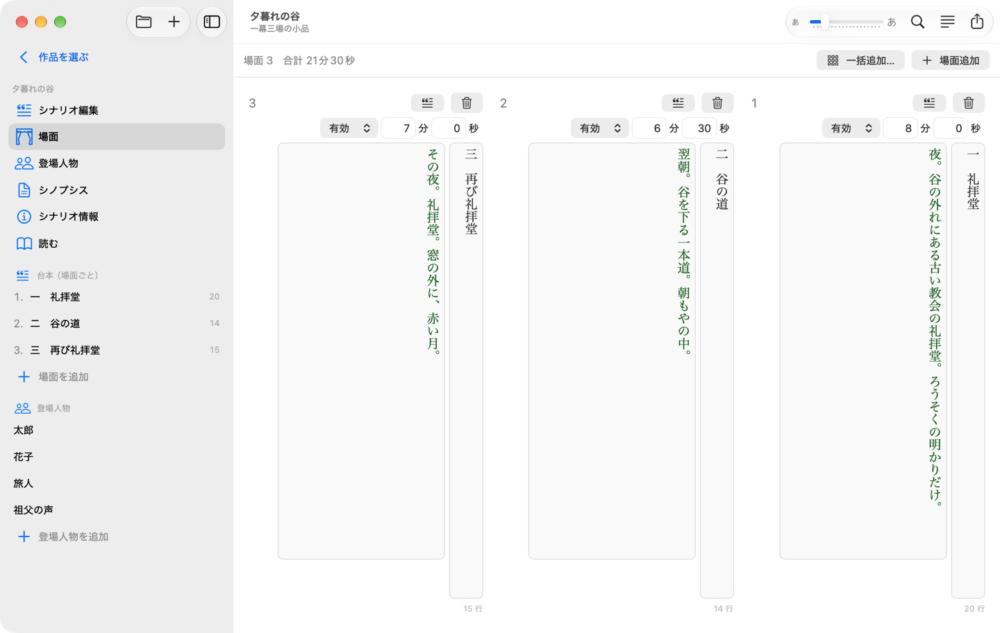
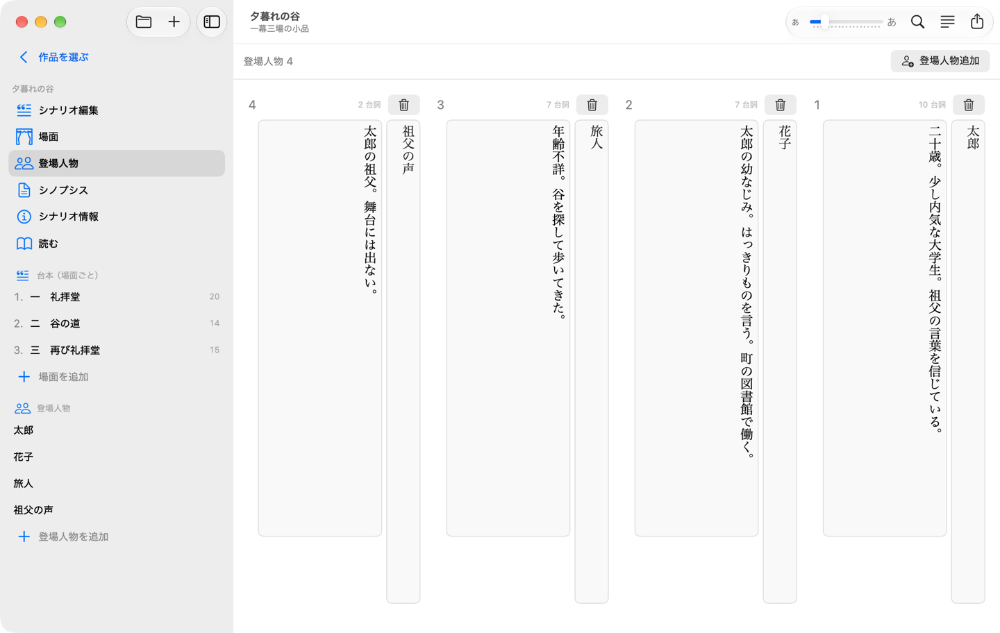
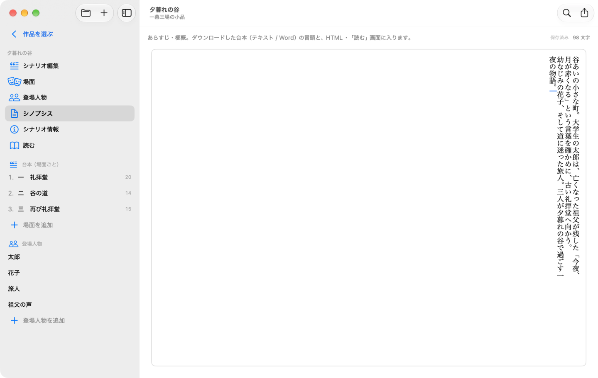
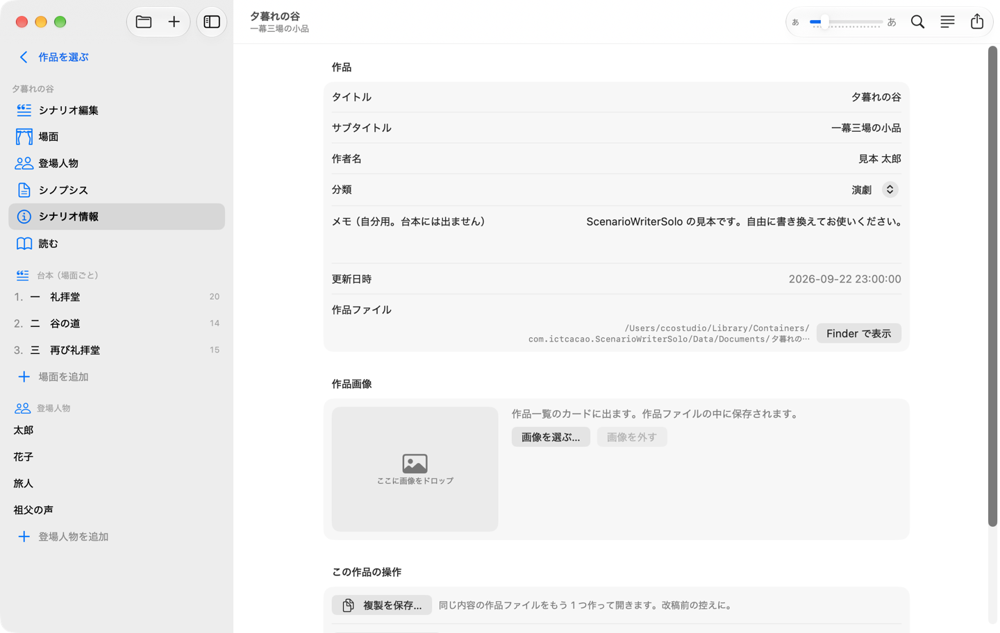
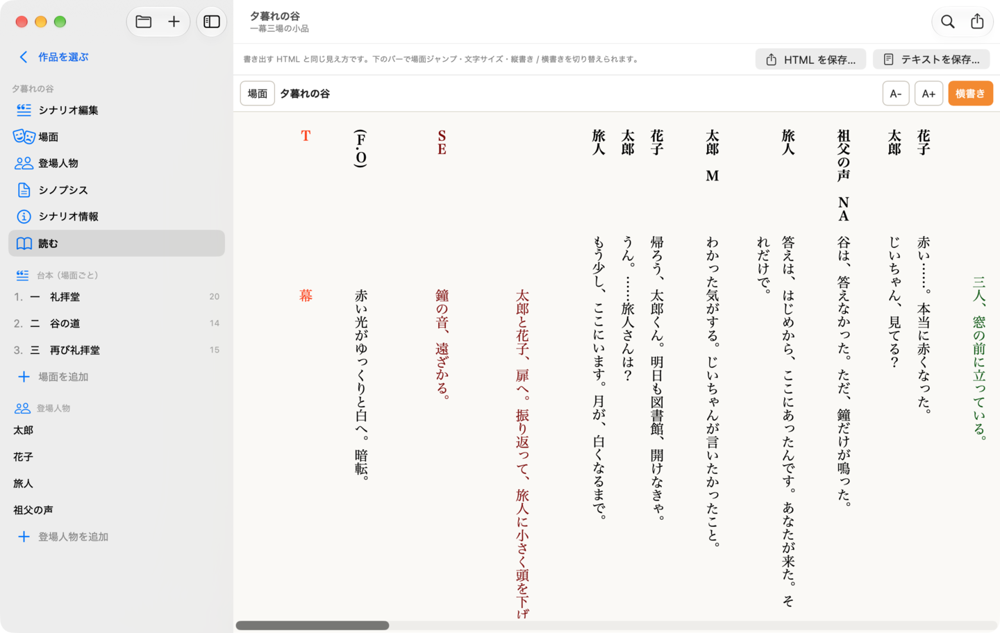
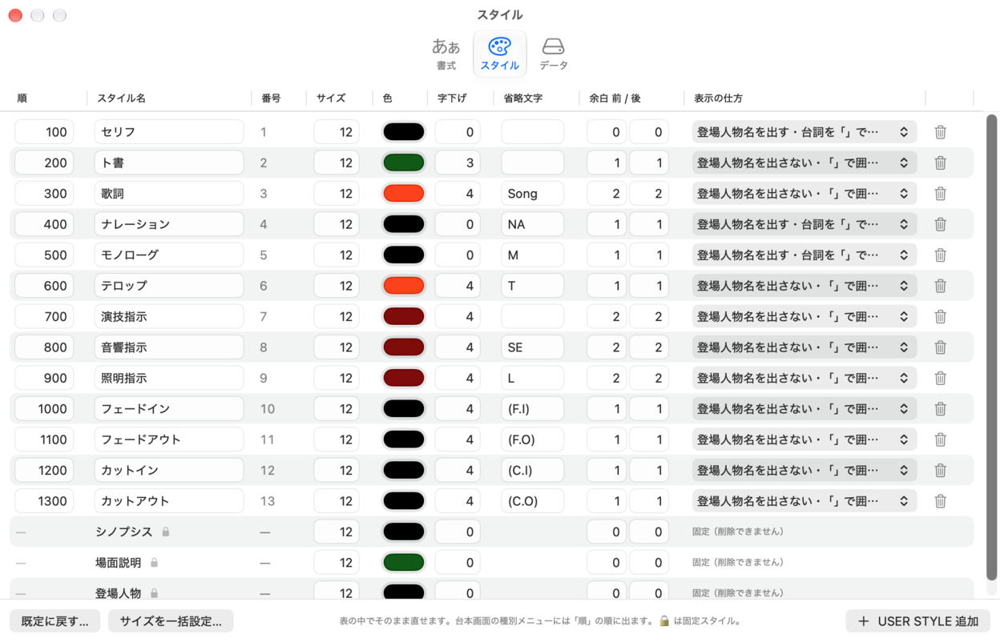
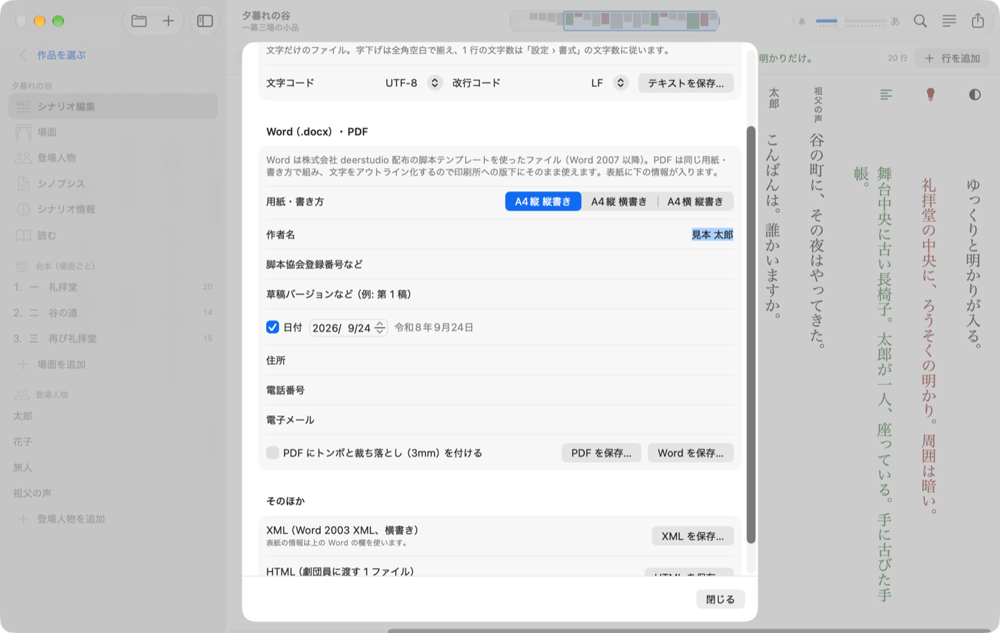

# ScenarioWriterSolo（Mac 版）マニュアル

β7.5　2026 年 9 月

ScenarioWriterSolo は、舞台・映像の脚本を書くためのひとり用エディタです。Web 版 ScenarioWriterCafe と同じ考え方で、PHP も Web サーバもログインも要りません。縦書きでの編集ができ、作品ファイル（`タイトル.scwd`）は Windows 版と共通です。

## 1. インストール

1. `ScenarioWriterSolo-β7.5.dmg` を開き、`ScenarioWriterSolo.app` を `Applications` へドラッグします。同じ DMG に見本の作品 `sample.scwd` も入っています。
2. 最初に起動するとき「開発元を確認できないため開けません」と出たら、Finder でアプリを右クリック →「開く」を選びます（署名していないため一度だけ必要です）。
3. macOS 15 以降の Mac（Apple Silicon / Intel）で動きます。

## 2. 作品ファイルと保存

- 作品は 1 つずつ `タイトル.scwd` というファイルです。中身は文字（JSON）で、Windows 版 ScenarioWriterSolo と相互に持ち運べます。
- ふつうの書類アプリと同じで、「ファイル › 開く…」（⌘O）で開き、「新規シナリオ…」（⌘N）では保存先を聞かれます。編集はアプリ内の作業用コピーに自動で書かれ、**保存（⌘S）で本ファイルへ書き戻します**。
- 未保存の変更があるとウインドウの閉じるボタンに点が付き、閉じる・終了・別の作品を開くときに「保存 / 保存しない / キャンセル」を聞きます。保存せずに落ちても、次回起動時に回復を提案します。
- 「別名で保存…」（⇧⌘S）「複製を保存…」「最後に保存した状態に戻す」「ゴミ箱に入れる…」「Finder で表示」もファイルメニューにあります。
- 起動すると前回開いていた作品がそのまま開きます。サイドバー上の「作品を選ぶ」（⇧⌘O）で最近使った作品の一覧に戻れます。
- β5 より前の `.scwd`（SQLite 形式）も開けて、保存すると新しい形式になります。たくさんあるときは「ファイル › 旧形式（SQLite）の作品ファイルをまとめて変換…」でフォルダごと変換できます（元のファイルは「旧形式」フォルダに残ります）。Windows 版は新しい形式だけを読みます。

## 3. 画面の構成

- **サイドバー**: 開いている作品の画面（シナリオ編集・場面・登場人物・シノプシス・シナリオ情報・読む）、台本（場面ごと、行数つき）、登場人物。場面をクリックするとその場面の台本、登場人物をクリックすると登場人物の画面に移ります。⌘1〜⌘6 でも切り替えられます。
- **ツールバー**: 中央にミニマップ（下の「ミニマップ」）。右に文字の大きさのスライダー、検索と置換（⌘F）、縦書き / 横書きの切り替え、書き出し。スライダーは編集画面では 設定 › 書式 の「基準サイズ」を、「読む」画面では読む画面の文字の大きさを変えます。
- **設定**（⌘,）: 書式 / スタイル / データ の 3 つのタブ。

## 4. 台本を書く（シナリオ編集）

1 行が「種別」「登場人物」「本文」の組です。上のバーで場面を選び（⌘[ / ⌘] で前後の場面）、「行を追加」で末尾に行を足します。

- **見出し**: ふだんは人物名だけが出ます（ト書・歌詞など人物を出さない種別は、その種別の色のアイコン）。名前やアイコンをクリックすると種別と登場人物の選択ボックスになり、人物を選ぶか本文をクリックすると閉じます。
- **種別**（セリフ・ト書・歌詞・ナレーション…）を選ぶと、色や字下げ、名前を出すかどうか、「」で囲むかがスタイルどおりに変わります。
- **登場人物**は、名前を出す種別のときだけ選べます。
- **本文**はそのまま打ちます。本文は 設定 › 書式 の「本文の文字数」（既定 32 文字、字下げのぶんは引く）で折り返します。「読む」画面やテキスト出力と同じ折り返しです。文字の大きさは 設定 › 書式 の「基準サイズ」（ツールバーのスライダーでも変えられます）× スタイルのサイズ ÷ 12 です。スライダーを動かすと、スタイルごとの大小の比率を保ったまま全体が拡大・縮小します。
- 行の右端の「…」（縦書きでは選択ボックスを開いたとき）から、前後に行を足す・前後へ動かす・削除ができます。右クリックでも同じメニューが出ます。縦書きではメニューの言い方が「左 / 右」になります。

### キー操作（本文の中で）

| キー | 動き |
|---|---|
| Tab / ⇧Tab | 次の行 / 前の行へ（縦書きでは左 / 右の列へ） |
| ⌘⏎ | この行の下に行を追加（⇧を足すと上に） |
| ⌘↓ / ⌘↑（横書き）、⌘← / ⌘→（縦書き） | 次の行 / 前の行へ |
| ⌘⌥↓ / ⌘⌥↑ | 行を下へ / 上へ動かす |
| ⌘⌫ | 行を削除 |
| ⌘Z / ⇧⌘Z | 元に戻す / やり直す。本文の文字入力はその欄の中で、行の追加・移動・削除・種別の変更・置換・場面や人物の操作は作品全体で効きます |
| Esc | 欄から抜ける |

### 縦書きと横書き

ツールバーの「縦書き / 横書き」ボタン（検索と置換の右）で一発で切り替えます。ボタンには押すと切り替わる先が出ます（横書きのときは「縦書き」、縦書きのときは「横書き」）。設定 › 書式 の「編集の書き方向」や「シナリオ › 縦書きで編集」（⌥⌘T）でも切り替えられます。縦書きでは行が右から左へ並び、各行の本文は上から下へ書きます。各列の上には人物名が縦書きで出ます。列の幅は本文に合わせて決まり、選択ボックスを開いた列だけ広がります。場面・登場人物・シノプシスの画面も縦書きになります。この設定は作品ファイルには入りません。

縦書きの台本は横に長くなるので、ページ送りのボタン（‹ ›）があります。マウスを画面の左端・右端の列（その画面の最後・最初の行）に持っていくと、その側に出ます（いつも出ていると本文に重なるため）。‹ で次のページ（左）へ、› で前のページ（右）へ、見えている幅のおよそ 1 画面ぶん動きます。場面の最後（左端）・先頭（右端）まで来たほうのボタンは消えます。

**ミニマップ**: 縦書きのときは、ツールバーの中央に場面全体を 1 本の帯にしたミニマップが出ます。行ごとに種別の色の細い棒が並び（本文は灰色、ト書は緑、歌詞は赤など。棒の高さは本文の長さ）、いま見えている範囲が青い枠で示されます。右端が場面の先頭です。帯をクリック・ドラッグするとその位置へ飛びます。

### 検索と置換（⌘F）

開いている作品の本文を検索し、1 件ずつ、または全部を置き換えます。置換は ⌘Z で戻せます。

## 5. 場面

場面名（柱）、有効 / 無効、上演時間の目安、場面説明を書きます。場面説明は台本の柱の下に出ます。並べ替えは行をドラッグするか右クリックメニューで。「一括追加…」で「第 1 幕 第 1 場」のような場面をまとめて作れます。

## 6. 登場人物

登場人物名と人物設定（年齢・性格など）を書きます。人物設定は「読む」画面と Word の人物表に出ます。削除すると、その人物の台詞は名前なしになりますが、台詞そのものは残ります。

## 7. シノプシス

あらすじ・梗概です。「読む」画面とテキスト / Word の冒頭に入ります。縦書きのときは、本文と同じ文字数で折り返した縦書きの欄になります。

## 8. シナリオ情報

題名・副題・作者名・分類・メモと、作品画像（一覧に出るサムネイル）です。

## 9. 読む

台本を通し読みする画面です。Web 版の「劇団員プレビュー」と同じ見た目で、登場人物表・シノプシス・場面ごとの柱と台詞が並びます。上のバーかツールバーの「縦書き / 横書き」ボタンで縦書き / 横書きを、上のバーで文字の大きさを変え、「場面」から場面へ飛べます。縦書きのときは、マウスを画面の左端・右端の列に持っていくとページ送りのボタン（‹ 次のページ / › 前のページ）が出ます（書き出した HTML にも付きます。スマホなどタッチ操作の端末ではいつも出ます）。ツールバーのミニマップには作品全体が出て、場面の区切りは縦の線になります。クリック・ドラッグでその位置へ飛べます。文字の大きさを変えても、読んでいる位置はそのままです。人物名欄と本文の幅は 設定 › 書式 の文字数に揃い、半角の英数・カナは全角で表示します。場面番号は出ません。

## 10. 設定

**書式**: 編集の書き方向（横書き / 縦書き）、編集画面のフォント（フォント・基準サイズ・行間・文字間隔）、見出し欄の文字数と本文の文字数、台詞を「」で囲むか、あなたの名前（Word の作成者に入ります）。

**スタイル**: 行の「種別」ごとの見た目です。表の中でそのまま直せます。

| 項目 | 意味 |
|---|---|
| 順 | 種別メニューに並ぶ順 |
| スタイル名 | 種別の名前 |
| 番号 | 台詞の種別番号（変えられません） |
| サイズ | 文字の大きさ。12 が基準で、編集画面・読む画面ともこの比率で大きくなります |
| 色 | 文字の色 |
| 字下げ | 本文の頭を下げる文字数 |
| 省略文字 | 名前を出さない種別で本文の前に付く印（NA / M / SE など） |
| 余白 前 / 後 | 「読む」画面と Word・テキストで行の前後に空ける行数（0〜4） |
| 表示の仕方 | 登場人物名を出すか、台詞を「」で囲むか |

「USER STYLE 追加」で種別を足し、ゴミ箱で消します（その種別を使っていた行は「種別 N」として残ります）。「既定に戻す」で最初の 13 種に戻ります。下の 3 行（シノプシス・場面説明・登場人物）は固定スタイルで、大きさ・色・字下げ・余白だけ変えられます。スタイルと書式は共通の設定で、開いた作品ファイルにも写されます。

**データ**: 共通設定の場所、Web 版との行き来（後述）。

## 11. 書き出し（ファイル › 台本を書き出す…、⌘E）

- **テキスト（.txt）**: 文字だけの台本。字下げは全角空白、1 行の文字数は書式の設定どおり。文字コード（UTF-8 / Shift_JIS）と改行コードを選べます。
- **Word（.docx）**: 株式会社 deerstudio 配布の脚本テンプレートを使った Word ファイル。用紙・書き方（A4縦 縦書き / A4縦 横書き / A4横 縦書き）と、表紙の情報（作者名・脚本協会登録番号・草稿バージョン・日付（和暦）・住所・電話番号・電子メール）を入れます。Word 2007 以降と Pages で開けます。
- **XML**: Word 2003 XML（横書き）。表紙の情報は Word の欄を使います。
- **HTML**: 劇団員に渡す 1 ファイル。スマホでも読め、縦書き / 横書きと文字サイズを切り替えられます。

## 12. Web 版との行き来

- **取り込み**（ファイル › Web 版・バックアップから取り込む…）: Web 版の `sw_config` フォルダごと（または `swdata.sqlite`）を選び、次に分割先のフォルダを選ぶと、中の作品が 1 作品 1 ファイルの `.scwd` になります。作品をまだ開いたことがなければスタイル設定も引き継ぎます。
- **書き出し**（ファイル › この作品を Web 版用に書き出す…）: 開いている作品を `swdata.sqlite` として保存します。Web 版の `sw_config/` に置くとそのまま開けます。

## 13. メニューとショートカット

| メニュー | 項目 | ショートカット |
|---|---|---|
| ファイル | 新規シナリオ… / 開く… / 最近使った作品 / 作品を選ぶ / 閉じる / 保存 / 別名で保存… / 複製を保存… / 最後に保存した状態に戻す / ゴミ箱に入れる… / 台本を書き出す… / Web 版用に書き出す… / 取り込む… / 旧形式をまとめて変換… / Finder で表示 | ⌘N / ⌘O / ⇧⌘O / ⌘W / ⌘S / ⇧⌘S / ⌘E |
| 編集 | 検索と置換、この下（上）に行を追加、次（前）の行へ、行を上（下）へ、行を削除 | ⌘F、⌘⏎（⇧⌘⏎）、⌘↓（⌘↑）、⌘⌥↑（⌘⌥↓）、⌘⌫ |
| シナリオ | シナリオ編集〜読む、縦書きで編集、前の場面 / 次の場面 | ⌘1〜⌘6、⌥⌘T、⌘[ / ⌘] |
| ヘルプ | ScenarioWriterSolo について（README） | |

## 14. 困ったとき

- **「開発元を確認できない」**: 右クリック →「開く」で一度だけ許可します。
- **Windows 版で「旧形式」と言われる**: Mac 版で開いて保存するか、「旧形式（SQLite）の作品ファイルをまとめて変換…」を使ってください。
- **文字が小さい / 大きい**: ツールバーのスライダー（設定 › 書式 の「基準サイズ」と同じ）で編集画面の大きさを変えられます。「読む」画面では同じスライダーか画面のバーで。
- **保存せずにアプリが落ちた**: 次に起動したとき「保存していない変更があります」と出るので「回復する」を選びます。
- **問題の報告**: ICTCacao（dbu@ictcacao.com）まで。作品ファイルと、出ていたメッセージを添えてもらえると助かります。
